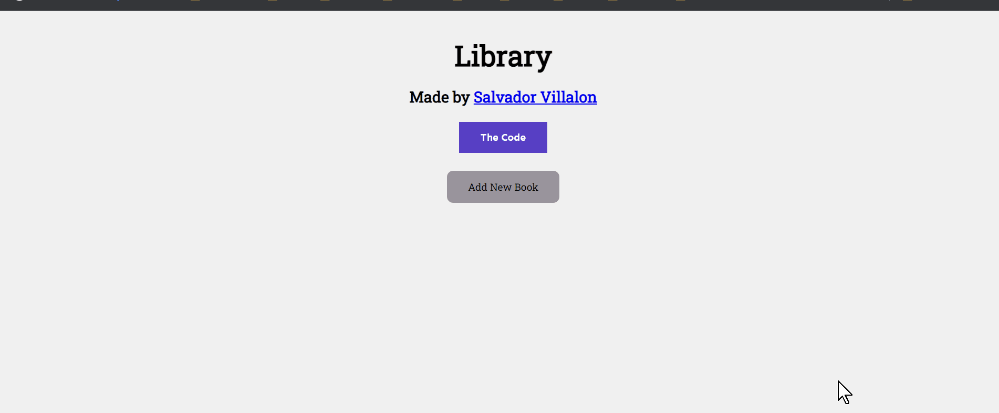

# theOdinProject-Library
[TheOdinProject: Javascript] - Project: Library

# Summary
Create a small library app that allows users to enter the books they have read
- Project Task: [The Odin Project - Library](https://www.theodinproject.com/courses/javascript/lessons/library)
- View Project: https://salvillalon45.github.io/theOdinProject-Library/

### Implementation 
- Used Object constructors to create new library instances and organize code
- Built with Firebase for data storage

### Demo

### 📗 Fonts used

-   [Roboto Slab](https://fonts.google.com/specimen/Roboto+Slab?query=Roboto+Slab)
-   [Sen](https://fonts.google.com/specimen/Sen)

# Technologies:
  - HTML
  - CSS
  - JavaScript
  - Firebase
